A Survey of Energy-related Ontologies
=====================================

Executive Summary Table
-----------------------

| Name                            | Domain                     | Organisation                                    | OWL?        |
|---------------------------------|----------------------------|-------------------------------------------------|-------------|
| DogOnt                          | Smart Homes                | Turin Polytechnic                               | Y           |
| BONSAI                          | Smart Homes                | Aristotle & International Hellenic Universities | Y           |
| COSE                            | Smart Homes/Environments   | Washington State University                     | Y           |
| SEAS                            | Sensors, Smart Homes       | SEAS consortium                                 | Y           |
| DEHEMS                          | Home Appliances            | Coventry University                             | N           |
| ThinkHOME                       | Smart Homes                | Vienna Tech                                     | Y           |
| Urban Energy Ontology (SEMANCO) | Smart Homes                | SEMANCO                                         | Broken Link |
| DomoML                          | Smart Homes                | Univ. of Applied Sciences, Switzerland          | Broken Link |
| SynCity (UES)                   | Smart Homes/Cities         | Imperial College London                         | N           |
| ENVISION                        | Sensors                    | University of Muenster                          | N           |
| AMON                            | Sensors                    | AMEE Ltd, Mastodon Ltd, Digital Catapult        | N (JSON)    |
| STS                             | Smart Homes (social focus) | Delft Tech                                      | N           |
| SESAME                          | Smart Homes                | FTW Telecommunications Research Centre, Vienna  | N           |
| OPTIMUS                         | Sensors                    | Ramon Llull, Barcelona & Torino Polytechnic     | N           |

ENVISION Ontology
-----------------

<https://www.researchgate.net/publication/220727277_SESAME_Demonstrator_Ontologies_Services_and_Policies_for_Energy_Efficiency>

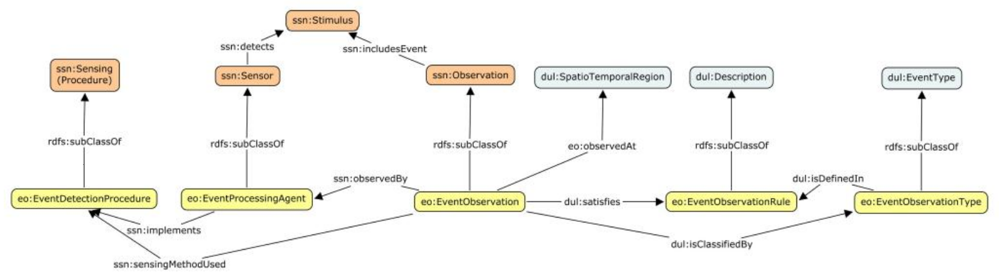

Event-based Sensor Service System.

Uses:

-   W3C's Semantic Sensor Network ontology
-   SOA4All (WSML, IRIS Reasoner)

Introduces:

-   A Service Ontology (SOS)
-   POSM (Operations, Preconditions, Effects)

BONSAI Ontology
---------------

BONSAI: A Smart Building Ontology for Ambient Intelligence <http://dl.acm.org/citation.cfm?doid=2254129.2254166>

Part of the ThinkHOME project, but instantiated in the Smart IHU (International Hellenic University) project (Smart Building project that targets energy savings, automation and quality of life in a University)

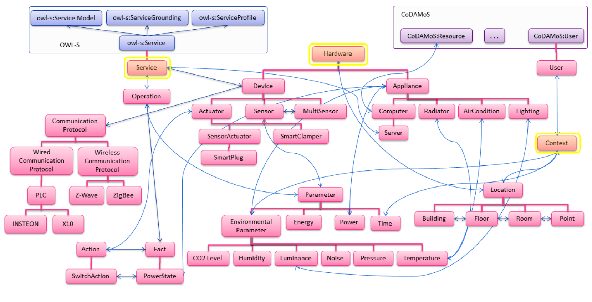

Slideshow: <http://lpis.csd.auth.gr/people/thanosgstavr/storage/publications/thanosWIMS2012ppt.pdf>

Hardware (Devices)

-   Device Role
    -   Sensor, Actuator, (MultiSensor, SensorActuator)
-   Device Communication protocol
    -   Wired, Wireless (PLC, ZigBee, Z-Wave, RF, etc)
-   Context
    -   Location, Environment params, time
-   Funcionality of services:
    -   Sensor parameter readings (environment and more)
    -   Actuator Effects (actions)

### Alignment

21 correspondences with DogOnt: <http://al4sc.inrialpes.fr/alid/1441722391874/9187>

OPTIMUS Ontology
----------------

<https://www.researchgate.net/publication/283087380_A_Semantic_Decision_Support_System_to_optimize_the_energy_use_of_public_buildings>

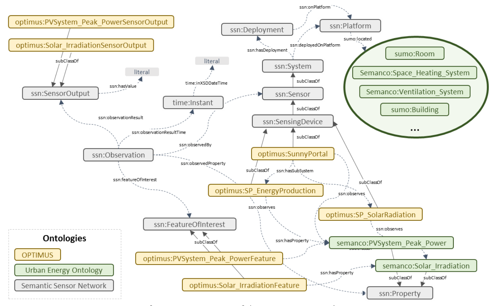

Under the bigger umbrella of the OPTIMUS project, this ontology is supplemented by a Decision Support System (DSS) to optimise CO2 usage.

Makes use of the SEMANCO platform (see the "Urban Energy Ontology" section).

OPTIMUS ontology was designed to capture and model information from different data sources.

AMON
----

Developed by [AMEE UK ltd](http://www.amee.com/), now maintained by [Mastodon C Ltd](http://www.mastodonc.com/), used by Digital Catapult to store their "embed" data.

I actually like this a lot, it is very simple and pragmatic.

From the Github site:

The AMON data format has been developed with the following goals in mind:

To be suitable for the description and exchange of metering/monitoring device data; To be human readable and self-documenting; To be able to be widely supported; To be bandwidth sensitive; To be simple; and To be extensible, easily supporting new data types.

To this end:

The data format defines a number of commonly used data fields for devices (such as the device name, its location etc.), and a number of commonly used data fields for device readings. This ensures that the data format is suitable for the description and exchange of metering/monitoring device data and is simple to use. The data format uses JSON encoding. This ensures that the data format balances the need to be human readable and self-documenting against the need to be bandwidth sensitive. Additionally, as most languages have library support for JSON encoding, AMON is able to be widely supported. Finally, although the data format does define commonly used data fields for devices and device readings, it does not exclude the use of custom device data or reading data. These can be described and exchanged using the AMON data format without modification to the data format, ensuring that the format is extensible.

### Example: temperature readings

This example shows a "device", with ID "d46ec860-fc7d-012c-25a6-0017f2cd3574".

The device is associated with the entity with ID "50af27e0-e61a-11e1-aff1-0800200c9a66".

The "device" has a "location", and has been defined with one "reading".

Two "measurements" for the defined "reading" exist.

``` json
{
  "devices": [
    {
      "deviceId": "d46ec860-fc7d-012c-25a6-0017f2cd3574",
      "entityId": "50af27e0-e61a-11e1-aff1-0800200c9a66",
      "description": "Example 1 Device",
      "location": {
        "name": "kitchen"
      },
      "readings": [
        {
          "type": "temperature",
          "unit": "C",
          "accuracy": 0.01
        }
      ],
      "measurements": [
        {
          "type": "temperature",
          "timestamp": "2010-07-02T11:39:09Z",
          "value": 23.5
        },
        {
          "type": "temperature",
          "timestamp": "2010-07-02T11:44:09Z",
          "value": 23.8
        }
      ]
    }
  ]
}
```

SESAME
------

<http://www.sciencedirect.com/science/article/pii/S0378778811005901>

(No image or OWL)

Includes general concepts, such as:

-   resident
-   location

Also, concepts in the automation/energy domain:

-   device
-   tariff
-   energy usage profile
-   account

And devices:

-   appliance
-   sensor
-   UI device

ThinkHome
---------

<http://www.sciencedirect.com/science/article/pii/S0378778811005901>

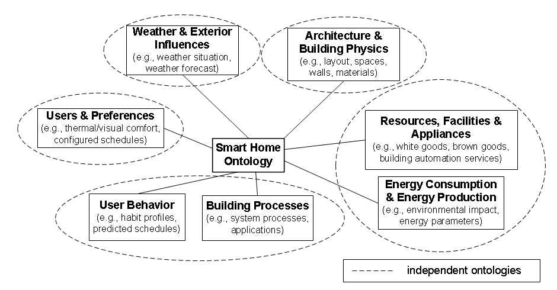

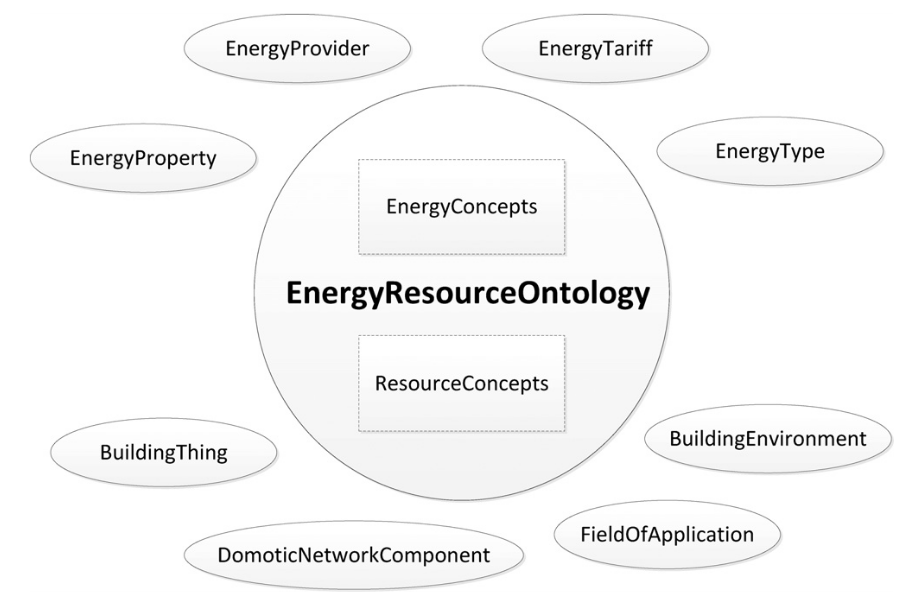

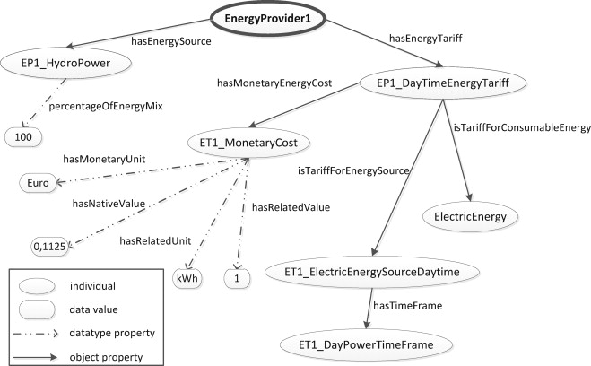

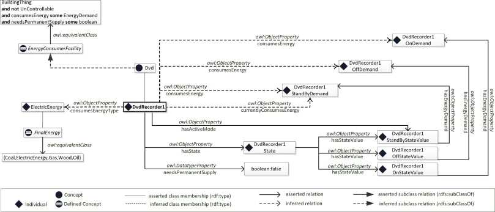

-   Actually consists of several ontologies. The one we'd be most interested in (to start with) is the "Energy Resource Ontology". Others could also be useful for describing user preferences & behaviour, though.
-   Designed with multi-agent systems in mind (there is mention of BDI agents in the paper).

Energy Resource Ontology:

-   It was created using DogOnt as a starting point, so could be good for us to use this instead (if it IS an improvement)
-   The paper claims that DogOnt focuses on energy consumers, whereas ThinkHome also looks at energy producing facilities (sources)

DEHEMS
------

<https://www.researchgate.net/profile/Kuo-Ming_Chao/publication/221014286_Ontology_for_Home_Energy_Management_Domain/links/54b977660cf2d11571a49eef.pdf> <http://link.springer.com/10.1007/978-3-642-22027-2_28>

Project name is DEHEMS: Digital Environment Home Energy Management System

Actual ontology is the "Home Appliances Ontology"

Designed as part of an energy-saving project. SUMO-compatible.

Knowledge base:

-   Various Household appliances
-   Consumption measurements
-   Energy Classes
-   Reasoning on the above

However:

-   Does not model services/sensors
-   Cannot be found online

### Image

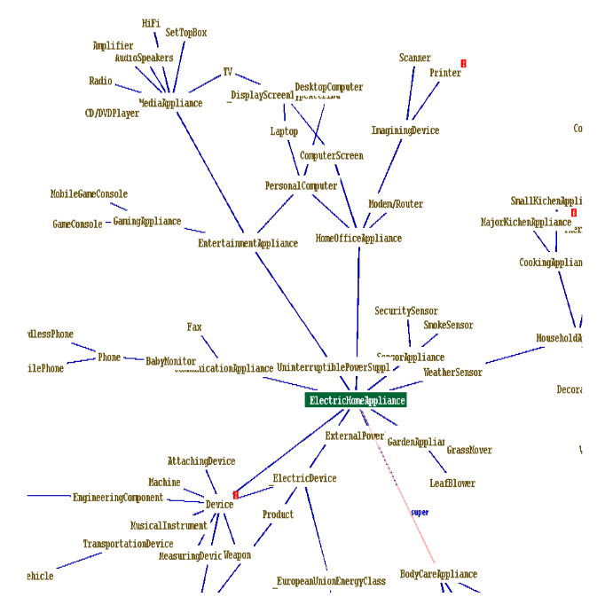

COSE
----

The Casas Ontology for Smart Environments

Sensor class hierarchy: 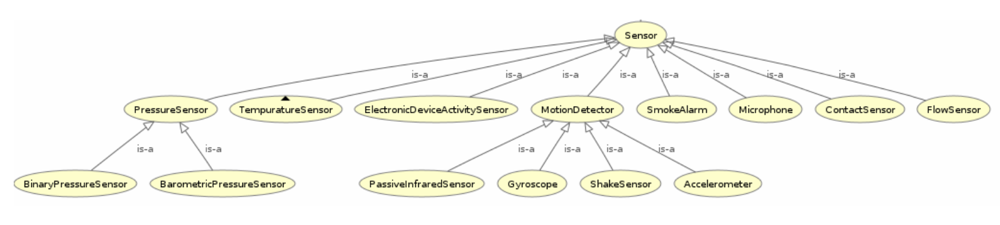

The COSE Ontology: Bringing the Semantic Web to Smart Environments <http://link.springer.com/chapter/10.1007/978-3-642-21535-3_27>

Main concepts are:

-   buildings
-   occupants
-   senors
-   human activities

OWL [link](http://casas.wsu.edu/owl/cose.owl) is broken, but I managed to find a copy on a university course website.

Has mappings to OpenCyc.

SEAS (Smart Energy Aware Systems)
---------------------------------

Part of the Smart Energy project: <https://the-smart-energy.com/>

Well documented. Ontologies and wiki are hosted here: <http://ci.emse.fr/seas/>

Consists of three main modules:

-   Feature of Interest Ontology (features of interest and their properties)
-   Evaluation Ontology (evaluations of these properties)
-   System Ontology (virtually isolated systems that share connections with other systems)

Imports a lot of other ontologies, and seems awfully complicated.

Urban Energy Ontology (SEMANCO)
-------------------------------

<http://www.semanco-tools.eu/urban-enery-ontology>

### Pros:

-   First link for Google search: "energy ontology"
-   Defined in OWL
-   SUMO-compatible

### Cons:

-   Every single link to the OWL is broken
-   Will have to email someone to get the ontology

Actually, there does appear to be OWL in a listing at the end of this file: <http://semanco-project.eu/index_htm_files/SEMANCO_D4.2_20130321.pdf>

SynCity
-------

"Synthetic City"

Modelled as a library of domain-specific components.

<http://siteresources.worldbank.org/INTURBANDEVELOPMENT/Resources/336387-1256566800920/6505269-1268260567624/Keirstead.pdf>

James Keirstead compares it to the STS ontology: <http://users.ecs.soton.ac.uk/acr/ates2010/Paper_04.pdf>

Superclasses within the ontology are:

-   Resources (energy resources, such as electricity or natural gas)
-   Infrastructures (physical structure of a city, including buildings and networks)
-   Processes (technologies that convert one set of resources to another)

-   UES (urban energy systems, Imperial College London) project. The UES ontology covers electricity and heat.
-   Aim is to: “identify the benefits of a systematic, integrated approach to the design and operation of urban energy systems, with a view to at least halving the energy intensity of cities”.

SynCity is more to do with "Processes" of converting energy from an input to an output.

STS
---

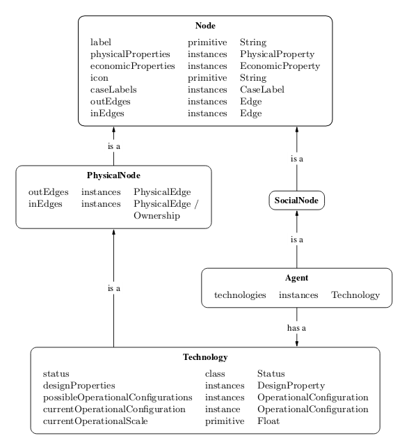

James Keirstead compares it to SynCity: <http://users.ecs.soton.ac.uk/acr/ates2010/Paper_04.pdf>

Everything appears to be a "node", connected with an "edge".

Scope is very wide: aims to bring together the social and physical aspects of infrastructure systems.

Integrates with agents: technologies are owned by an agent, who makes decisions on how to use the technology. Their choices are constrained according to the properties of the tech they use.

DogOnt: Ontology Modeling for Intelligent Domotic Environments
--------------------------------------------------------------

<http://elite.polito.it/ontologies/dogont.owl> <http://lov.okfn.org/dataset/lov/vocabs/dogont>

<http://porto.polito.it/1838746/1/paper31_camera_ready.pdf> <http://link.springer.com/chapter/10.1007/978-3-540-88564-1_51>

Turin Polytechnic

Can be seen as an advancement of DomoML, reusing parts of it.

Provides house modelling and reasoning capabilities to the DOG (Domotic OSGi Gateway)

Homepage link is dead

5 main hierarchy trees:

-   building thing: modelling available things
-   building environment: modelling where things are located
-   state: stable configs that (controllable) things can assume
-   functionality: modelling what controllable things can do
-   domotic network component: modelling features peculiar of each domotic plant

Appears to be a very extensive and relevant ontology for what we want.


DomoML
------

<http://ceur-ws.org/Vol-166/34.pdf> Ontology for Human Home Interaction

Main taxonomy elements: 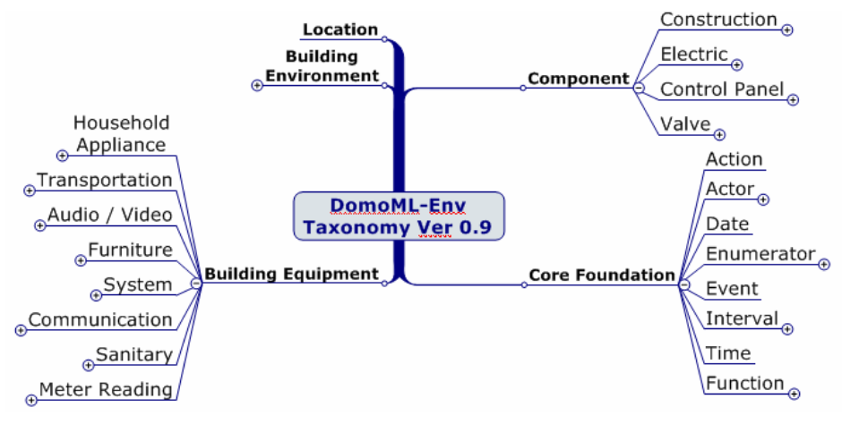

Household appliances: 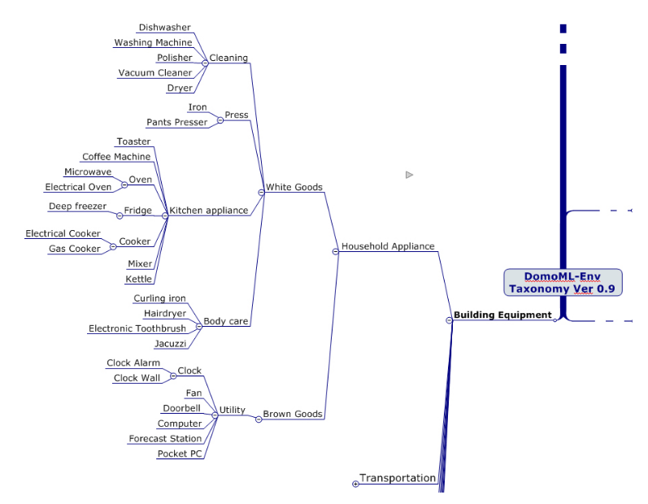

A suite of XML-based languages that cover:

-   environmental elements (DomoML-env)
-   functions of elements (DomoML-fun)
-   communications of elements (DomoML-com)

Main superclasses of DomoML-env are:

-   Building-Equipment (house appliances)
-   Component (switches, valves, sensors, etc)
-   Core-Foundation (technical/base elements of components)
-   Building-Environment (rooms: kitchen, dining room, etc)
-   Location (location of element within domestic environment)

    No state modelling (as criticised by DogOnt creators)

It **is** specified in OWL (200 OWL classes), though there doesn't appear to be any online
